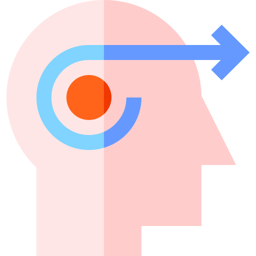

# Hey! It's Gilbert's Digital Garden 🌱

Hi all, welcome to my [[DigitalGarden|DigitalGarden]]. I've been taking a lot of notes in [[Obsidian|Obsidian]] and I came across some Digital Garden's. I love the idea of learning in Public, so I decided to give it a go.

Unlike my [blog](https://gilbertsanchez.com/) the idea is that these are notes at various stages of completion. Often I like to have a concrete idea and goal around what my blog posts should teach/convey. This often leaves a lot of knowledge behind this barrier of completion.

At some point I'll document how I built this site with [[Obsidian|Obsidian]] and [Quartz](https://quartz.jzhao.xyz/). I went through various iterations using [[PowerShell|PowerShell]] scripts, [[Hugo|Hugo]], and [[MkDocs|MkDocs]].

## Map's of Content

I have a few (ha!) interests and these are the categories of how I break them down.

    

        <a href="./MOC/Learning MOC">
            Learning
            
        </a>
    

    

        <a href="./MOC/Coding MOC">
            Coding
            
        </a>
    

    

        <a href="./MOC/FLow MOC">
            Flow
            
        </a>
    

    

        <a href="./MOC/Leadership MOC">
            Leadership
            
        </a>
    

    

        <a href="./MOC/Habits MOC">
            Habits
            
        </a>
    

     

        <a href="./MOC/Philosophy MOC">
            Habits
            
        </a>
    

    

        <a href="./MOC/Work MOC">
            Work
            
        </a>
    

